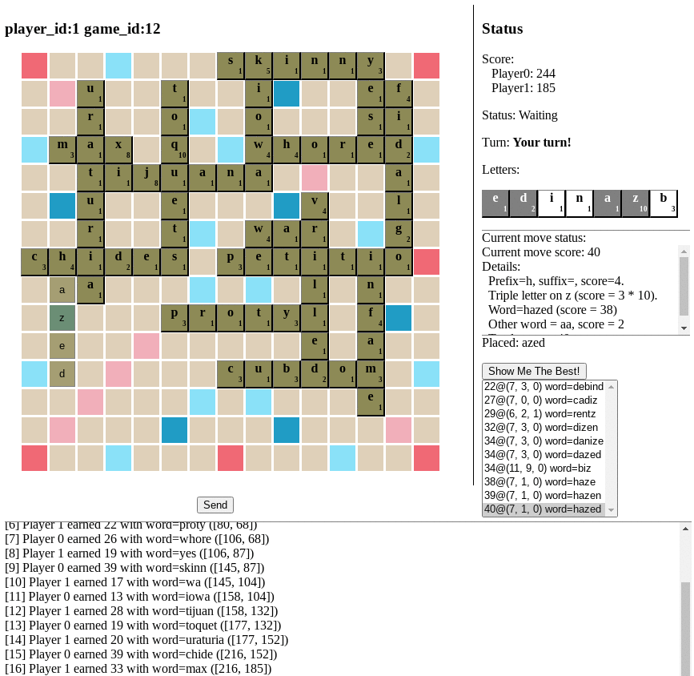

# Scrabble move generator

This is a simple scrabble move generator. (Here's a video of two simple bots playing each other: https://youtu.be/iOVH9jXfGPM)

The moves are based on a prexisting dictionary:

* Each valid position on the board is considered
* For the number of blanks, the appropriate number of letters are chosen from the users letters
* All words are looked up from the dictionary (hashed)
* Candidate words are scored.


## Command line interface

Run the CLI with:
```
python3 scrabble.py words.txt words.2.txt words.3.txt [seed]
```

## Web interface

```
python3 web.py [server]
```

Visit http://localhost:8000 and create a game. Join the game using the provided links.

The web service stores game state in "games" upon closing. So you could resume, if desired.




## Unimplemented features

* End of game scoring
* Blank squares are not supported

